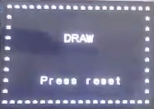

# Tic-Tac-Toe

[](https://opensource.org/licenses/mit-license.php) 

<u>If you use this project, please reference the repository :)</u>

**Table of Contents**

- [What is the Tic-Tac-Toe game?](https://github.com/jeongwhanchoi/tic-tac-toe-lpc1768#what-is-the-tic-tac-toe-game)

- [Flow Chart](https://github.com/jeongwhanchoi/tic-tac-toe-lpc1768###flow-chart)
- [Interface](https://github.com/jeongwhanchoi/tic-tac-toe-lpc1768###interface)
- https://github.com/jeongwhanchoi/tic-tac-toe-lpc1768#what-is-the-tic-tac-toe-game
- [Game Display](https://github.com/jeongwhanchoi/tic-tac-toe-lpc1768###game-display)
	- [Intro GUI](https://github.com/jeongwhanchoi/tic-tac-toe-lpc1768####intro-gui)
	- [Game GUI](https://github.com/jeongwhanchoi/tic-tac-toe-lpc1768####game-gui)
	- [Game Play](https://github.com/jeongwhanchoi/tic-tac-toe-lpc1768####game-play)
	- [Player O Win Result ](https://github.com/jeongwhanchoi/tic-tac-toe-lpc1768####player-0-win-result )
	- [The game end in a draw](https://github.com/jeongwhanchoi/tic-tac-toe-lpc1768####the-game-end-in-a-draw)


## Tic-Tac-Toe Game lpc 1768 Project 

### What is the Tic-Tac-Toe game?

**Tic-tac-toe** is a [paper-and-pencil game](https://en.wikipedia.org/wiki/Paper-and-pencil_game) for two players, *X* and *O*, who take turns marking the spaces in a 3×3 grid. The player who succeeds in placing three of their marks in a horizontal, vertical, or diagonal row wins the game.

The following example game is won by the first player, X:


### Flow Chart


Above is a flow chart showing Tic-Tac-Toe's algorithm. We made a 1-D array with a size of 9 corresponding to the Tic-Tac-Toe board, and gave values from 1 to 9.

And if you press the keypad, O or X is entered in the corresponding position array and the number of turn increases. If these inputs are repeated over and over again, the game ends and the winner is output. If there is no winner and the number of turn reaches 9, the Tic-Tac-Toe board is full with O or X, so the game ends and a draw is output.

### Interface

- LCD
  - [`GLCD.h`](https://github.com/jeongwhanchoi/tic-tac-toe-lpc1768/blob/f5c0275a4a6d835c9af59c581e706ea2884f1e99/TTT.c#L3)
- Keypad
  - [`Keypad.h`](https://github.com/jeongwhanchoi/tic-tac-toe-lpc1768/blob/f5c0275a4a6d835c9af59c581e706ea2884f1e99/TTT.c#L2)

### Game Display

#### Intro GUI

- [`intro()`](https://github.com/jeongwhanchoi/tic-tac-toe-lpc1768/blob/f5c0275a4a6d835c9af59c581e706ea2884f1e99/TTT.c#L121-L137)


#### Game GUI

- [`gameIsPlay()`](https://github.com/jeongwhanchoi/tic-tac-toe-lpc1768/blob/f5c0275a4a6d835c9af59c581e706ea2884f1e99/TTT.c#L100-L119)
- [`drawRect()`](https://github.com/jeongwhanchoi/tic-tac-toe-lpc1768/blob/f5c0275a4a6d835c9af59c581e706ea2884f1e99/TTT.c#L87-L98)
  - We created a function to draw a 3x3 board using [`GLCD_putPixel()`](https://github.com/jeongwhanchoi/tic-tac-toe-lpc1768/blob/f5c0275a4a6d835c9af59c581e706ea2884f1e99/TTT.c#L95) and call it from [`gameIsPlay()`](https://github.com/jeongwhanchoi/tic-tac-toe-lpc1768/blob/f5c0275a4a6d835c9af59c581e706ea2884f1e99/TTT.c#L100-L119)to use it.


#### Game Play

- [`gameIsPlay()`](https://github.com/jeongwhanchoi/tic-tac-toe-lpc1768/blob/f5c0275a4a6d835c9af59c581e706ea2884f1e99/TTT.c#L100-L119)


- [`printOX()`](https://github.com/jeongwhanchoi/tic-tac-toe-lpc1768/blob/f5c0275a4a6d835c9af59c581e706ea2884f1e99/TTT.c#L21-L35)
  - Output O or X in the corresponding cell ((x,y) coordinates)
  - The turn is output as the ASCII code value:
    - ASCII code of O is 79
    - ASCII code of X is 88

```c
void printOX(int input, int x, int y, int *turn)		// print O and X at (x,y) coordinates
{
	if(array[input-1] == 79 || array[input-1] == 88 )		// if the array already has O or X (TO PREVENT DUPLICATE ENTRIES)
		{
			GLCD_displayStringLn(Line1, "*     TRY AGAIN    *");
			Delay(SEC_1);
		}
		else		// there are empty entries
			{
				array[input-1] = *turn;		// input O or X
				GLCD_displayChar(x, y, *turn);		// print O and X at (x,y) coordinates
				changeTurn(&*turn);
				count++;		// increment the count
			}
}
```

#### Player O Win Result 


- if [`winFlag`](https://github.com/jeongwhanchoi/tic-tac-toe-lpc1768/blob/f5c0275a4a6d835c9af59c581e706ea2884f1e99/TTT.c#L188)  is not zero(0), display "Player O Win"


#### The game end in a draw

- if [`winFlag`](https://github.com/jeongwhanchoi/tic-tac-toe-lpc1768/blob/f5c0275a4a6d835c9af59c581e706ea2884f1e99/TTT.c#L188) is zero, display "DRAW"

