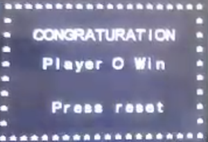

# Tic-Tac-Toe

[Imgbot](https://img.shields.io/badge/imgbot-optimized-lightgrey.svg)

## Tic-Tac-Toe Game lpc 1768 Project 

### What is the Tic-Tac-Toe game?

**Tic-tac-toe** is a [paper-and-pencil game](https://en.wikipedia.org/wiki/Paper-and-pencil_game) for two players, *X* and *O*, who take turns marking the spaces in a 3×3 grid. The player who succeeds in placing three of their marks in a horizontal, vertical, or diagonal row wins the game.

The following example game is won by the first player, X:

### Flow Chart

### Game Display

#### Intro GUI

#### Game GUI

#### Game Play

#### Player O Win

#### Player O Win Result 

